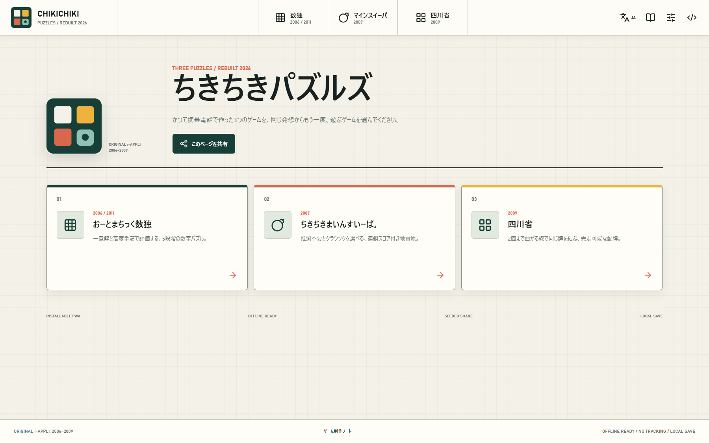

# Chikichiki Puzzles

**English** | [日本語](./README.ja.md)

Installable PWA rebuilds of three puzzle games originally created as NTT DOCOMO i-appli titles between 2006 and 2009.

[](https://kenrouse.github.io/chikichiki-puzzles/)

## Play

**[Open Chikichiki Puzzles](https://kenrouse.github.io/chikichiki-puzzles/)**

After the first visit, the app can run offline. Game progress, preferences, and records stay in the browser's local storage and are not sent to an external service.

## Games

- **Automatic Sudoku**: Uniquely solvable Classic puzzles verified with Algorithm X / Dancing Links, five difficulty levels including a Beginner level guaranteed to finish with naked singles, human-technique ratings, Answer and Notes input, undo, hints, candidate guidance, and matching-number highlights. Symmetric and Killer generators remain available as opt-in preview features under Settings while their gameplay is refined.
- **Chikichiki Minesweeper**: A safe first move, guess-free and classic generation selected under Game settings, Open and Mark touch modes, right-click and hold marking, drag protection, fit-to-screen sizing, cascade scoring, best scores and times, and distinct indicators for the actual mine and the mine that ended the game.
- **Shisen-Sho**: Matching-tile paths with at most two turns, guaranteed-solvable layouts, path animation, manual zoom and fit-to-screen sizing, initial-board review after a clear, and three difficulty levels based on mobility.

## Highlights

- Deterministic seeded generation and shareable URLs, QR codes, Web Share, and copy actions.
- Japanese and English UI, instructions, ARIA labels, dialogs, and in-app design notes.
- Mouse, touch, pen, and keyboard input with accessible focus states and reduced-motion support.
- Local save and resume, offline PWA support, four color themes, generated BGM, sound effects, and independent volume controls.
- Fullscreen and focus modes, responsive board fitting, clear ranking rules, and next-grade guidance on result screens.
- New boards are generated only when play is confirmed, then covered by an opaque three-second countdown so the puzzle is not exposed before play begins. Saved games resume without another countdown.
- Visible labels and tooltips have separate roles: labeled controls receive extra context only when useful, while icon-only controls retain concise accessible names.

## Language Support

The app has first-class Japanese and English localization. This file is the default English repository entry point; [README.ja.md](./README.ja.md) is the maintained Japanese counterpart.

Code identifiers and APIs use English. Detailed engineering documents in [`docs/`](./docs/README.md) are currently maintained in Japanese as the source of truth; browser translation can assist with languages that do not yet have maintained documentation.

## Technology

- React 19 / TypeScript 6 / Vite 8
- `vite-plugin-pwa` / Workbox
- Web Audio API / `qrcode.react`
- Vitest / ESLint
- GitHub Actions / GitHub Pages

Game rules and generation engines are pure TypeScript modules independent of the React UI. The same seed and generation options reproduce the same board.

## Documentation

- [Documentation index](./docs/README.md)
- [Design decisions](./docs/design-decisions.md)
- [Roadmap](./docs/roadmap.md)

The in-app Design Notes explain generation algorithms for players, while each game's expandable How to play section covers rules, controls, strategies, and grade thresholds.

## Development

Use Node.js 24 or later and npm 11 or later.

```powershell
npm ci
npm run dev
```

Validation commands:

```powershell
npm run lint
npm test
npm run build
```

The production build uses `/chikichiki-puzzles/` as its GitHub Pages base path.